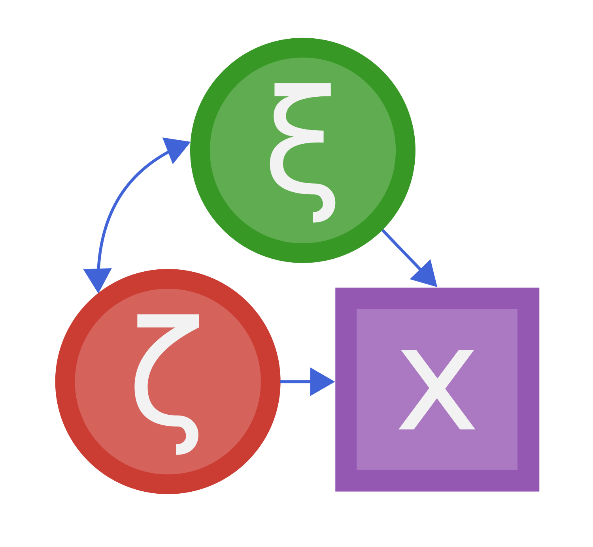

# StructuralEquationModels.jl

This is a package for Structural Equation Modeling. It is still *in development*. Models you are able to fit include
- Linear SEM that can be specified in RAM (or LISREL) notation
- ML, GLS and FIML estimation
- Ridge Regularization
- Multigroup SEM
- Sums of arbitrary loss functions (everything the optimizer can handle).

We provide fast objective functions, gradients and for some cases hessians as well as approximate hessians.
As a user, you can easily define your own loss functions. You can decide to provide gradients or use finite difference approximation / automatic differentiation. Also, if you are optimizing over a sum of different objectives (e.g. ML + Ridge), you may use analytic gradients for some parts of the objective and automatic differentiation for others.

You may consider using this package if:
- you want to extend SEM (e.g. add a new objective function) and need an extendable framework
- you want to extend SEM and your implementation needs to be fast (because you want to do a simulation for example)
- you want to fit the same model(s) to many datasets (bootstrapping, simulation studies)
- you are planning a study and would like to do power simulations

The package makes use of
- Symbolics.jl for symbolically precomputing parts of the objective and gradients to generate fast, specialized functions.
- SparseArrays.jl to speed up symbolic computations.
- Optim.jl and NLopt.jl to provide a range of different Optimizers/Linesearches.
- FiniteDiff.jl and ForwardDiff.jl to provide gradients for user-defined loss functions.

Prior to release of the package we are still working on
- optimizing performance for big models with hundreds of parameters