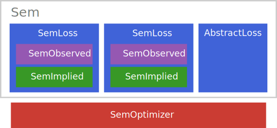

# Extending the package

As discussed in [Our Concept of a Structural Equation Model](@ref), a `Sem` is built from one or more loss
terms, and each SEM loss function bundles an *observed* and an *implied* part:

On the following pages, we will explain how you can define your own custom parts (a loss function, an observed
type, an implied type, or an optimizer) and "plug them in". There are certain things you **have to do** to define custom parts and some things you **can do** to have a more pleasent experience. In general, these requirements fall into the categories
- minimal (to use your custom part and fit a `Sem` with it)
- use the outer constructor to build a model in a more convenient way
- use additional functionality like standard errors, fit measures, etc.