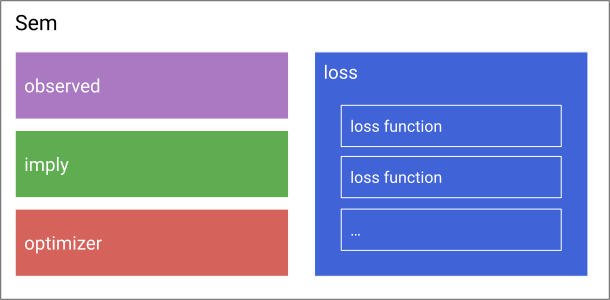
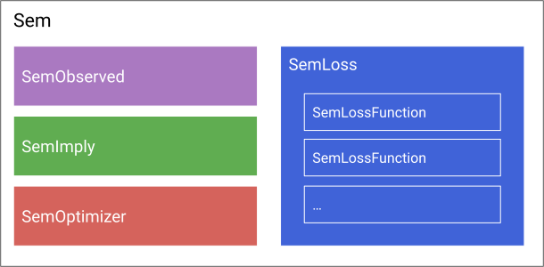

# Our Concept of a Structural Equation Model

In our package, every Structural Equation Model (`Sem`) consists of three parts (four, if you count the optimizer):



Those parts are interchangable building blocks (like 'Legos'), i.e. there are different pieces available you can choose as the `observed` slot of the model, and stick them together with other pieces that can serve as the `implied` part.

The `observed` part is for observed data, the `implied` part is what the model implies about your data (e.g. the model implied covariance matrix), and the loss part compares the observed data and implied properties (e.g. weighted least squares difference between the observed and implied covariance matrix).
The optimizer part is not part of the model itself, but it is needed to fit the model as it connects to the optimization backend (e.g. the type of optimization algorithm used).

For example, to build a model for maximum likelihood estimation with the NLopt optimization suite as a backend you would choose `SemML` as a loss function and `SemOptimizerNLopt` as the optimizer.

As you can see, a model can have as many loss functions as you want it to have. We always optimize over their (weighted) sum. So to build a model for ridge regularized full information maximum likelihood estimation, you would choose two loss functions, `SemFIML` and `SemRidge`.

In julia, everything has a type. To make more precise which objects can be used as the different building blocks, we require them to have a certain type:



So everything that can be used as the 'observed' part has to be of type `SemObserved`.

Here is an overview on the available building blocks:

|[`SemObserved`](@ref)            | [`SemImplied`](@ref)  | [`SemLossFunction`](@ref) | [`SemOptimizer`](@ref)        |
|---------------------------------|-----------------------|---------------------------|-------------------------------|
| [`SemObservedData`](@ref)       | [`RAM`](@ref)         | [`SemML`](@ref)           | [`SemOptimizerOptim`](@ref)   |
| [`SemObservedCovariance`](@ref) | [`RAMSymbolic`](@ref) | [`SemWLS`](@ref)          | [`SemOptimizerNLopt`](@ref)   |
| [`SemObservedMissing`](@ref)    | [`ImpliedEmpty`](@ref)| [`SemFIML`](@ref)         |                               |
|                                 |                       | [`SemRidge`](@ref)        |                               |
|                                 |                       | [`SemConstant`](@ref)     |                               |

The rest of this page explains the building blocks for each part. First, we explain every part and give an overview on the different options that are available. After that, the [API - model parts](@ref) section serves as a reference for detailed explanations about the different options.
(How to stick them together to a final model is explained in the section on [Model Construction](@ref).)

## The observed part aka [`SemObserved`](@ref)

The *observed* part contains all necessary information about the observed data. Currently, we have three options: [`SemObservedData`](@ref) for fully observed datasets, [`SemObservedCovariance`](@ref) for observed covariances (and means) and [`SemObservedMissing`](@ref) for data that contains missing values.

## The implied part aka [`SemImplied`](@ref)
The *implied* part is what your model implies about the data, for example, the model-implied covariance matrix.
There are two options at the moment: [`RAM`](@ref), which uses the reticular action model to compute the model implied covariance matrix, and [`RAMSymbolic`](@ref) which does the same but symbolically pre-computes part of the model, which increases subsequent performance in model fitting (see [Symbolic precomputation](@ref)). There is also a third option, [`ImpliedEmpty`](@ref) that can serve as a 'placeholder' for models that do not need an implied part.

## The loss part aka `SemLoss`
The loss part specifies the objective that is optimized to find the parameter estimates.
If it contains more then one loss function (aka [`SemLossFunction`](@ref))), we find the parameters by minimizing the sum of loss functions (for example in maximum likelihood estimation + ridge regularization).
Available loss functions are
- [`SemML`](@ref): maximum likelihood estimation
- [`SemWLS`](@ref): weighted least squares estimation
- [`SemFIML`](@ref): full-information maximum likelihood estimation
- [`SemRidge`](@ref): ridge regularization

## The optimizer part aka `SemOptimizer`
The optimizer part of a model connects to the numerical optimization backend used to fit the model.
It can be used to control options like the optimization algorithm, linesearch, stopping criteria, etc.
There are currently three available backends, [`SemOptimizerOptim`](@ref) connecting to the [Optim.jl](https://github.com/JuliaNLSolvers/Optim.jl) backend, [`SemOptimizerNLopt`](@ref) connecting to the [NLopt.jl](https://github.com/JuliaOpt/NLopt.jl) backend and [`SemOptimizerProximal`](@ref) connecting to [ProximalAlgorithms.jl](https://github.com/JuliaFirstOrder/ProximalAlgorithms.jl).
For more information about the available options see also the tutorials about [Using Optim.jl](@ref) and [Using NLopt.jl](@ref), as well as [Constrained optimization](@ref) and [Regularization](@ref) .

# What to do next

You now have an understanding of our representation of structural equation models.

To learn more about how to use the package, you may visit the remaining tutorials.

If you want to learn how to extend the package (e.g., add a new loss function), you may visit [Extending the package](@ref).

# API - model parts

## observed

```@docs
SemObserved
SemObservedData
SemObservedCovariance
SemObservedMissing
samples
observed_vars
SemSpecification
```

## implied

```@docs
SemImplied
RAM
RAMSymbolic
ImpliedEmpty
```

## loss functions

```@docs
SemLoss
SemLossFunction
SemML
SemFIML
SemWLS
SemRidge
SemConstant
```

## optimizer

```@eval OptDocs
using StructuralEquationModels, NLopt

StructuralEquationModels.optimizer_engine_doc(:NLopt)
```

```@setup OptDocs
using StructuralEquationModels, NLopt

SemOptimizerNLopt = Base.get_extension(StructuralEquationModels, :SEMNLOptExt).SemOptimizerNLopt
```

```@docs
SemOptimizer
SemOptimizerOptim
SemOptimizerNLopt
```