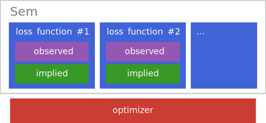

# Our Concept of a Structural Equation Model

In our package, a structural equation model (a [`Sem`](@ref)) is built from one or more **loss terms**.
Fitting the model means finding the parameters that minimize the (weighted) sum of all of its loss terms.
This simple idea is remarkably general: within the same structure it covers a single SEM fit by maximum
likelihood, a regularized SEM (e.g. maximum likelihood plus a ridge penalty), and multigroup models
(one SEM term per group).



A loss term is anything of type [`AbstractLoss`](@ref) — a function that maps the model parameters to a
number that should be minimized. There are two kinds of loss terms:

- **SEM loss functions** ([`SemLoss`](@ref)), such as [`SemML`](@ref), [`SemWLS`](@ref) and [`SemFIML`](@ref),
  measure how well the model explains the data. To do so, each `SemLoss` *bundles its own observed part
  (the data) and implied part (what the model implies about the data)*. They are the heart of a SEM.
- **Other loss functions**, such as the regularization terms [`SemRidge`](@ref) and [`SemConstant`](@ref),
  depend only on the parameters and therefore need neither an observed nor an implied part.

Because a model is just a (weighted) sum of loss terms, you can freely combine them.
For example, ridge-regularized full information maximum likelihood estimation is a model with two loss terms,
a [`SemFIML`](@ref) term and a [`SemRidge`](@ref) term. A two-group model is a model with two [`SemML`](@ref)
terms, one per group, weighted by the respective sample sizes.

All models are subtypes of [`AbstractSem`](@ref). The default [`Sem`](@ref) computes the weighted sum of its
loss terms together with their (analytic) gradients. [`SemFiniteDiff`](@ref) is an alternative that
approximates the gradient with finite differences, which is useful for loss functions that do not provide an
analytic gradient.

## The parts of a SEM loss

Each SEM loss function ([`SemLoss`](@ref)) is itself composed of interchangeable building blocks (like 'Legos'):
an *observed* part and an *implied* part. To make precise which objects can play each role, we require them to
have a certain type:


So everything that can serve as the *observed* part has to be of type [`SemObserved`](@ref), everything that can
serve as the *implied* part has to be of type [`SemImplied`](@ref), and the loss function that combines them is a
[`SemLoss`](@ref). To fit the model, you additionally choose a [`SemOptimizer`](@ref); it connects to the
numerical optimization backend but is not itself part of the model.

Here is an overview on the available building blocks:

|[`SemObserved`](@ref)            | [`SemImplied`](@ref)  | [`AbstractLoss`](@ref)    | [`SemOptimizer`](@ref)     |
|---------------------------------|-----------------------|---------------------------|----------------------------|
| [`SemObservedData`](@ref)       | [`RAM`](@ref)         | [`SemML`](@ref)           | [:Optim](@ref StructuralEquationModels.SemOptimizerOptim)                     |
| [`SemObservedCovariance`](@ref) | [`RAMSymbolic`](@ref) | [`SemWLS`](@ref)          | [:NLopt](@ref SEMNLOptExt.SemOptimizerNLopt)                     |
| [`SemObservedMissing`](@ref)    | [`ImpliedEmpty`](@ref)| [`SemFIML`](@ref)         | [:Proximal](@ref SEMProximalOptExt.SemOptimizerProximal)                  |
|                                 |                       | [`SemRidge`](@ref)        |                            |
|                                 |                       | [`SemConstant`](@ref)     |                            |

The rest of this page explains each building block and the available options. After that, the
[API - model parts](@ref) section serves as a reference for detailed explanations.
(How to stick the building blocks together into a final model is explained in the section on
[Model Construction](@ref).)

## The observed part aka [`SemObserved`](@ref)

The *observed* part contains all necessary information about the observed data, and pre-computes the statistics
a loss function needs from it — for example the observed covariance matrix, or the different patterns of
missingness used for full information maximum likelihood (FIML) estimation.
Currently, we have three options: [`SemObservedData`](@ref) for fully observed datasets,
[`SemObservedCovariance`](@ref) for observed covariances (and means) and [`SemObservedMissing`](@ref) for data
that contains missing values.

## The implied part aka [`SemImplied`](@ref)
The *implied* part defines how the model-implied statistics (for example, the model-implied covariance matrix
and mean vector) are computed from the parameters.
There are two options at the moment: [`RAM`](@ref), which uses the reticular action model to compute the model
implied covariance matrix, and [`RAMSymbolic`](@ref) which does the same but symbolically pre-computes part of
the model, which increases subsequent performance in model fitting (see [Symbolic precomputation](@ref)). There
is also a third option, [`ImpliedEmpty`](@ref) that can serve as a 'placeholder' for loss terms that do not need
an implied part.

## The loss functions aka [`AbstractLoss`](@ref)
The loss terms specify the objective that is minimized to find the parameter estimates; a model minimizes the
(weighted) sum of all its loss terms.
SEM loss functions ([`SemLoss`](@ref)) compare what the model implies to the observed data, while regularization
terms depend only on the parameters.
Available loss functions are
- [`SemML`](@ref): maximum likelihood estimation
- [`SemWLS`](@ref): weighted least squares estimation
- [`SemFIML`](@ref): full-information maximum likelihood estimation
- [`SemRidge`](@ref): ridge regularization
- [`SemConstant`](@ref): adds a constant to the objective

## The optimizer aka [`SemOptimizer`](@ref)
The optimizer connects to the numerical optimization backend used to fit the model. It is not part of the model
itself, but it is chosen when fitting (see [Model fitting](@ref)).
It can be used to control options like the optimization algorithm, linesearch, stopping criteria, etc.
There are currently three available engines (i.e., backends used to carry out the numerical optimization), [`:Optim`](@ref StructuralEquationModels.SemOptimizerOptim) connecting to the [Optim.jl](https://github.com/JuliaNLSolvers/Optim.jl) backend, [`:NLopt`](@ref SEMNLOptExt.SemOptimizerNLopt) connecting to the [NLopt.jl](https://github.com/JuliaOpt/NLopt.jl) backend and [`:Proximal`](@ref SEMProximalOptExt.SemOptimizerProximal) connecting to [ProximalAlgorithms.jl](https://github.com/JuliaFirstOrder/ProximalAlgorithms.jl).
For more information about the available options see also the tutorials about [Using Optim.jl](@ref) and [Using NLopt.jl](@ref), as well as [Constrained optimization](@ref) and [Regularization](@ref) .

# What to do next

You now have an understanding of our representation of structural equation models.

To learn more about how to use the package, you may visit the remaining tutorials.

If you want to learn how to extend the package (e.g., add a new loss function), you may visit [Extending the package](@ref).

# API - model parts

## observed

```@docs
SemObserved
SemObservedData
SemObservedCovariance
SemObservedMissing
samples
observed_vars
SemSpecification
em_mvn
```

## implied

```@docs
SemImplied
RAM
RAMSymbolic
ImpliedEmpty
```

## loss functions

```@docs
AbstractLoss
SemLoss
SemML
SemFIML
SemWLS
SemRidge
SemConstant
```

## optimizer

```@docs
optimizer_engines
optimizer_engine
optimizer_engine_doc
SemOptimizer
SEM.SemOptimizerOptim
SEMNLOptExt.SemOptimizerNLopt
SEMProximalOptExt.SemOptimizerProximal
```